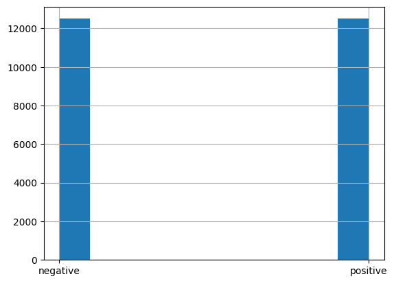

# SMA-SS-LLM

Projet d'analyse de sentiment (Sentiment Analysis) sur des reviews de films IMDB avec une approche LLM orientee prompts: `zero-shot`, `few-shot` et `few-shot + chain-of-thought`.

Le travail principal est realise dans le notebook `sa.ipynb`, avec comparaison de strategies de prompting et evaluation via score F1.

## Objectif

Construire un mini pipeline d'experimentation agentic AI pour:

1. Charger et preparer le dataset IMDB.
2. Construire des prompts robustes (zero-shot, few-shot, CoT).
3. Evaluer les predictions d'un LLM sur un echantillon de verite terrain.
4. Comparer rapidement des backends LLM (`ChatOpenAI` et `ChatOllama`).

## Stack Technique

- Python `>=3.13`
- `datasets` (Hugging Face)
- `pandas`, `numpy`
- `scikit-learn` (split train/test, F1)
- `langchain`, `langchain-openai`, `langchain-ollama`
- `python-dotenv`
- `matplotlib`
- `jupyter` / `ipykernel`

Dependances configurees dans `pyproject.toml`.

## Structure Du Projet

```text
sma-ss-llm/
|- sa.ipynb                  # Notebook principal (dataset, prompts, evaluation)
|- main.py                   # Point d'entree Python minimal
|- pyproject.toml            # Configuration projet/dependances
|- docs/
|  \- screenshots/
|     \- sentiment_distribution.png
\- README.md
```

## Pipeline (Notebook)

Le notebook suit globalement ce workflow:

1. Chargement du dataset `imdb` avec `load_dataset("imdb")`.
2. Transformation de la colonne `label` vers `sentiment` (`positive` / `negative`).
3. Separation du jeu de donnees en `examples_df` (few-shot) et `gold_examples_df` (evaluation).
4. Construction de trois variantes de prompts: `zero_shot_prompt`, `few_shot_prompt`, `cot_few_shot_prompt`.
5. Evaluation via `evaluate_prompt(...)`: inference review par review, extraction du label predit, puis calcul du `f1_score(..., average="micro")`.

## Sortie Visuelle (Screen)

Distribution des classes dans le dataset (capture extraite des outputs du notebook):



## Installation Et Lancement

### Option 1: avec `uv` (recommande)

```bash
uv sync
```

Puis lancer le notebook:

```bash
uv run jupyter notebook
```

### Option 2: venv classique

```bash
python -m venv .venv
# Windows PowerShell
.\.venv\Scripts\Activate.ps1
pip install -U pip
pip install -e .
jupyter notebook
```

## Configuration Des Modeles

### OpenAI (LangChain)

1. Creer un fichier `.env` a la racine.
2. Ajouter:

```env
OPENAI_API_KEY=your_key_here
```

Verification recommandee (sans afficher la cle):

```python
import os
print(bool(os.getenv("OPENAI_API_KEY")))
```

### Ollama (local)

S'assurer qu'Ollama tourne localement et que le modele existe:

```bash
ollama pull llama3.2
```

Le notebook utilise:

```python
llm2 = ChatOllama(model="llama3.2", temperature=0)
```

## Exemples De Sortie Texte

Le notebook log chaque prediction avec ce format:

```text
Review: <texte review>
Predicted: positive|negative|unknown
Ground Truth: positive|negative
```

Puis retourne un score final:

```text
F1 micro: <valeur>
```

